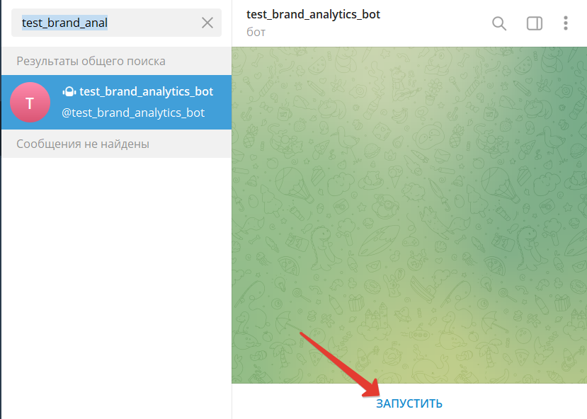

# Тестоваое задание. [Компания Brand Analytics](https://br-analytics.ru/)
## Описание

Чтобы воспользоваться функцианалом телеграм-бота, необходимо выполнить следующие шаги:
1. Найти в телеграме бота с именем **test_brand_analytics_bot** или перйти по ссылке [test_brand_analytics_bot](t.me/test_brand_analytics_bot)
2. Чтобы начать диалог с ботом необходимо нажать кнопку "Запустить"

## Задание
Написать телеграм-бот с минимальным функционалом.

Бот получает от пользователя ссылку, переходит по ней и делает скриншот страницы и сохраняет код ответа страницы. Полученный скриншот и код страницы отправляется обратно пользователю

Технические требования
Реализовать на языке Python.
Все настройки бот должен брать из переменных окружения.
Скриншоты страниц бот должен сохранять в папку (путь до неё настраивается) с именем в формате «YYYY-MM-DD_HH:mm_<link>.jpg».

YYYY — год, четыре знака,

MM — месяц, два знака,

DD — день, два знака,

HH — часы, 24 часовой формат, два знака,

mm — минуты, два знака,

<link> — ссылка, присланная пользователем

Критерии оценивания
За каждый пункт начисляется один балл, максимум 4.

Бот выполняет заявленные функции.
Код оформлен в репозиторий на Github/Bitbucket.
Бот использует как можно меньше внешних зависимостей, необходимые зависимости указаны в requirements.txt
Для бота написан Dockerfile для сборки образа.

Бонус-баллы
За каждый пункт начисляется один балл, максимум 2.

Есть юнит-тесты.
Для бота есть инструкция по запуску в README.md проекта.

Срок выполнения
Тестовое задание необходимо выполнить и прислать результат в ответ на это письмо не позднее 20.01 10:00
