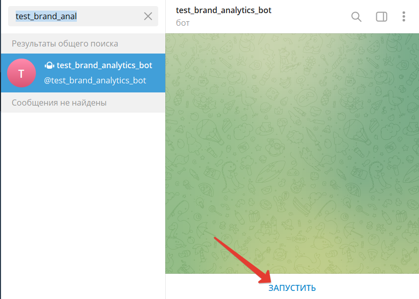

# Тестоваое задание. [Компания Brand Analytics](https://br-analytics.ru/)
## Описание

Чтобы воспользоваться функционалом телеграм-бота, необходимо выполнить следующие шаги:
1. Найти в телеграме бота с именем **test_brand_analytics_bot** или перйти по ссылке [test_brand_analytics_bot](t.me/test_brand_analytics_bot) 
2. Чтобы начать диалог с ботом необходимо нажать кнопку "Запустить"
<center>
    
</center>

3. Отправить боту ссылку на страницу, скриншот которой необходимо сделать.
   - ссылки необходимо присылать в виде:
     - **http://** ссылка.ru(.com,...)
     - **https://** ссылка.ru(.com,...)

## Установка Windows
## Установка Linux
1. Проверить установлен ли python:
```bush
    python3 --version
```
Если не установлен, то необходимо установить:
```bash
    sudo apt install python3
```
3. Установить git:
```bash
    sudo apt install git
```
4. Установить pip
```bash
    sudo apt install python3-pip
    python3 -m pip install --upgrade pip
```
5. Установить виртуальное окружение
```bash
  pip3 install virtualenv
```
6. Клонировать проект из репозитория
```bash
  git clone https://github.com/LevKakalashvili/tc_telebot.git
```
7. Создайте файл .env
```bash
    touch tc_telebot/.env
```
8. Заполнить файл .env, как указано в шаблоне .env_example
   * BOT_TOKEN - выданный токен для бота
   * SCREENSHOT_FOLDER - папка для сохранения скриншотов, по умолчанию скриншоты сохраняются в ``tc_telebot/srceenshots_default/`` 
   * SCREENSHOT_RESOLUTION_WIDTH - ширина скришота в пикселях
   * SCREENSHOT_RESOLUTION_HEIGHT - высота скриншота в пикселях
9. Установить Google Chrome и Chrome WebDriver
```bash
wget https://dl.google.com/linux/direct/google-chrome-stable_current_amd64.deb
sudo dpkg -i google-chrome-stable_current_amd64.deb
sudo apt-get install -yqq unzip
sudo apt  install curl
wget -O /tmp/chromedriver.zip http://chromedriver.storage.googleapis.com/`curl -sS chromedriver.storage.googleapis.com/LATEST_RELEASE`/chromedriver_linux64.zip
sudo unzip /tmp/chromedriver.zip chromedriver -d /usr/local/bin/
```
10. Перейти в папку с проектом
```bash
    cd tc_telebot/
```
12. Создать папку 
```bash
  mkdir screenshots_default
```
13. Создать виртуальное окружение
```bash
    virtualenv env
```
14. Активировать виртуальное окружение
```bash
    source env/bin/activate
```
15. Устанвить необходимые зависимости
```bash
    pip install -r requirements.txt
```
16. Запустить бота
```bash
  python3 app_bot/run.py & 
```
17. Проверить работоспособность бота

## Задание
Написать телеграм-бот с минимальным функционалом.
Бот получает от пользователя ссылку, переходит по ней и делает скриншот страницы и сохраняет код ответа страницы. Полученный скриншот и код страницы отправляется обратно пользователю
Технические требования
- Реализовать на языке Python.
- Все настройки бот должен брать из переменных окружения.
  - Скриншоты страниц бот должен сохранять в папку (путь до неё настраивается) с именем в формате «YYYY-MM-DD_HH:mm_<link>.jpg».
YYYY — год, четыре знака,
    - MM — месяц, два знака,
      - DD — день, два знака, 
      - HH — часы, 24 часовой формат, два знака,
      - mm — минуты, два знака,
      - \<link> — ссылка, присланная пользователем

### Критерии оценивания
За каждый пункт начисляется один балл, максимум 4.
- Бот выполняет заявленные функции.
- Код оформлен в репозиторий на Github/Bitbucket.
- Бот использует как можно меньше внешних зависимостей, необходимые зависимости указаны в requirements.txt
- Для бота написан Dockerfile для сборки образа.

#### Бонус-баллы
За каждый пункт начисляется один балл, максимум 2.
- Есть юнит-тесты.
- Для бота есть инструкция по запуску в README.md проекта.

### Срок выполнения
Тестовое задание необходимо выполнить и прислать результат в ответ на это письмо не позднее 20.01 10:00
